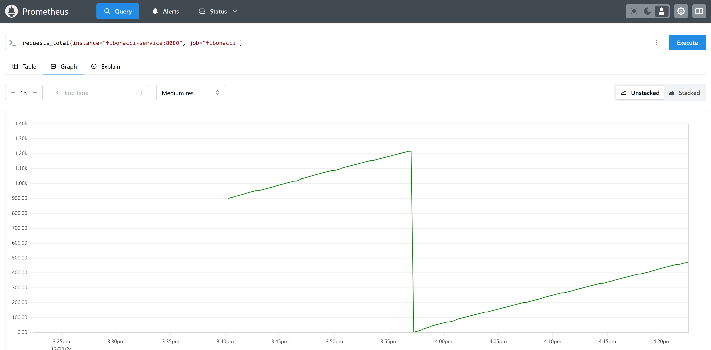
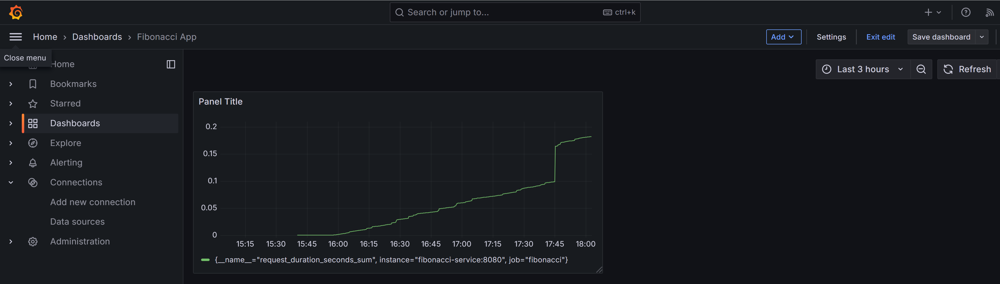

# Tech Stack used in this Project


# Rust App that calculates the Fibonacci sequence and deploys it to Kubernetes 
[](https://github.com/yourusername/Rust-Fibonacci-Kubernetes-Prometheus-Grafana/actions/workflows/rust.yml)

> [!TIP]
> * This project provides various implementations of the Fibonacci sequence in Rust, including recursive, memoized, iterative, and dynamic programming approaches. 
> * It also includes a Kubernetes deployment with Helm charts deploying to minikube.
> * Cluster has also Prometheus and Grafana installed to monitor the application.


> [!TIP] 
> The Fibonacci sequence is a series of numbers in which each number is the sum of the two preceding ones, usually starting with 0 and 1.

> [!TIP]
> The sequence starts: 0, 1, 1, 2, 3, 5, 8, 13, 21, 34, ...

> [!TIP]
> The Fibonacci sequence is defined by the recurrence relation: F(n) = F(n-1) + F(n-2) with base cases F(0) = 0 and F(1) = 1.

> [!TIP]
> The Fibonacci sequence grows exponentially, so the recursive implementation is not efficient for large values of n.

> [!TIP]
> The iterative and dynamic programming implementations are more efficient for large values of n.

> [!TIP]
> The memoized recursive implementation is more efficient than the simple recursive implementation because it avoids redundant calculations.

> [!TIP]
> The pattern matching implementation is similar to the simple recursive implementation but uses pattern matching instead of if-else statements.

> [!TIP]
> The dynamic programming implementation uses an array to store the Fibonacci numbers and avoids redundant calculations.

The following implementations are provided:

- `fibonacci`: A simple recursive implementation.
- `fibonacci_match`: A recursive implementation using pattern matching.
- `fibonacci_dp`: An implementation using dynamic programming.
- `fibonacci_memo`: A memoized recursive implementation.
- `fibonacci_iterative`: An iterative implementation.


## Prerequisites
> [!IMPORTANT]
> Before you begin, ensure you have the following tools installed:
> 1. **Rust & Cargo** (for local builds/verification, optional if you only build in Docker).
> 2. **Docker** (to build and push container images).
> 3. **Helm** (to manage Kubernetes deployments).
> 4. **Minikube or a Kubernetes Cluster** (for testing).
> 5. **Docker Hub Account** (to push container images).
> 6. **Make** (for using the Makefile automation - see installation below).

### Installing Make on Windows

Choose one of these options:

**Option 1: Chocolatey**
```cmd
choco install make
```

**Option 2: Scoop**
```cmd
scoop install make
```

**Option 3: Use Git Bash** (comes with Git for Windows)

**Option 4: Use WSL** (Windows Subsystem for Linux)

---

## GitHub Secrets Configuration

> [!IMPORTANT]
> If you're using GitHub Actions for CI/CD, you need to set up the following secrets:

### Setting up Docker Hub Credentials

1. Go to your GitHub repository
2. Navigate to **Settings** → **Secrets and variables** → **Actions**
3. Click **New repository secret**
4. Add the following secrets:

| Secret Name | Description | Example Value |
|------------|-------------|---------------|
| `DOCKER_USERNAME` | Your Docker Hub username | `yourusername` |
| `DOCKER_PASSWORD` | Your Docker Hub password or access token | `dckr_pat_xxxxx` |

> [!TIP]
> **Using Docker Hub Access Tokens (Recommended)**:
> 1. Log in to [Docker Hub](https://hub.docker.com/)
> 2. Go to **Account Settings** → **Security** → **New Access Token**
> 3. Create a token with **Read, Write, Delete** permissions
> 4. Use this token as `DOCKER_PASSWORD` (more secure than your actual password)

### For Local Development

You can use a `.env` file for convenience:

1. Copy the example file:
   ```cmd
   copy .env.example .env
   ```

2. Edit `.env` and fill in your Docker Hub credentials

3. Load the variables:

**Windows (CMD):**
```cmd
for /F "tokens=*" %i in (.env) do set %i
```

**Windows (PowerShell):**
```powershell
Get-Content .env | ForEach-Object {
    if ($_ -match '^([^=]+)=(.*)$') {
        [Environment]::SetEnvironmentVariable($matches[1], $matches[2])
    }
}
```

**Linux/Mac:**
```bash
export $(cat .env | xargs)
```

> [!WARNING]
> Never commit `.env` file to Git! It's already in `.gitignore`.

Or set the environment variable before running commands:

**Windows (CMD):**
```cmd
set DOCKER_USERNAME=yourusername
docker build -t %DOCKER_USERNAME%/fibonacci_rust:v104 .
```

**Windows (PowerShell):**
```powershell
$env:DOCKER_USERNAME = "yourusername"
docker build -t ${env:DOCKER_USERNAME}/fibonacci_rust:v104 .
```

**Linux/Mac:**
```bash
export DOCKER_USERNAME=yourusername
docker build -t ${DOCKER_USERNAME}/fibonacci_rust:v104 .
```

---

## Quick Start with Makefile

> [!TIP]
> A Makefile is provided for easy Grafana setup and service management!

**Check if services are running:**
```cmd
make check-all
```

**Port-forward Grafana:**
```cmd
make grafana
```

**Port-forward all services at once:**
```cmd
make all
```

**Generate test traffic:**
```cmd
make traffic
```

**View all available commands:**
```cmd
make help
```

---

## How to Run the Application

### Option 1: Run Locally (Development)
> [!TIP]
> This is the fastest way to test changes during development. Make sure you have Rust and Cargo installed.

**Step 1: Build the project**
```cmd
cargo build
```

**Step 2: Run the application**
```cmd
cargo run
```

**Step 3: Access the application**
- Open your browser and navigate to `http://localhost:8080`
- The application will start on port 8080

**Step 4: Test the Fibonacci API**
You can use curl or Postman to test the endpoints:
```cmd
curl -X POST http://localhost:8080/fib -H "Content-Type: application/json" -d "{\"n\": 10}"
```

**Step 5: Check application health**
```cmd
curl http://localhost:8080/health
curl http://localhost:8080/ready
```

**Step 6: View metrics (Prometheus format)**
```cmd
curl http://localhost:8080/metrics
```

> [!NOTE]
> The application creates a log file at `/var/log/fibonacci.log` when running with log4rs configured.

### Option 2: Run in Docker (Containerized)
> [!TIP]
> Use this approach for consistent environment across machines and to simulate production-like deployment.

**Step 1: Build the Docker image**
```cmd
docker build -t fibonacci_rust:latest .
```

**Step 2: Run the Docker container**
```cmd
docker run -p 8080:8080 --name fibonacci fibonacci_rust:latest
```

**Step 3: Access the application**
- Open your browser and navigate to `http://localhost:8080`

**Step 4: View container logs**
```cmd
docker logs fibonacci
```

**Step 5: Stop and remove the container**
```cmd
docker stop fibonacci
docker rm fibonacci
```

#### Push to Docker Hub
```cmd
docker login --username your_docker_username
docker tag fibonacci_rust:latest your_docker_username/fibonacci_rust:v1.0
docker push your_docker_username/fibonacci_rust:v1.0
```

#### Push to Azure Container Registry (ACR)
```cmd
az login
az acr login --name your_registry_name
docker tag fibonacci_rust:latest your_registry_name.azurecr.io/fibonacci_rust:v1.0
docker push your_registry_name.azurecr.io/fibonacci_rust:v1.0
```

#### Push to Google Container Registry (GCR)
```cmd
gcloud auth login
gcloud auth configure-docker
docker tag fibonacci_rust:latest gcr.io/your_project_id/fibonacci_rust:v1.0
docker push gcr.io/your_project_id/fibonacci_rust:v1.0
```

#### Push to AWS Elastic Container Registry (ECR)
```cmd
aws ecr get-login-password --region your_aws_region | docker login --username AWS --password-stdin your_account_id.dkr.ecr.your_aws_region.amazonaws.com
docker tag fibonacci_rust:latest your_account_id.dkr.ecr.your_aws_region.amazonaws.com/fibonacci_rust:v1.0
docker push your_account_id.dkr.ecr.your_aws_region.amazonaws.com/fibonacci_rust:v1.0
```

#### Push to Private Registry
```cmd
docker login your_private_registry_url
docker tag fibonacci_rust:latest your_private_registry_url/fibonacci_rust:v1.0
docker push your_private_registry_url/fibonacci_rust:v1.0
```

### Option 3: Run in Kubernetes with Helm (Production)
> [!TIP]
> Use this approach for production deployments with Prometheus monitoring and Grafana visualization.

#### Docker Image Available on Docker Hub
> [!IMPORTANT]
> The image has been successfully pushed to Docker Hub:
> - **Image**: `${DOCKER_USERNAME}/fibonacci_rust:v104`
> - **Version**: v104 ✅ (Latest - Clean & Fixed)
> - **Previous Versions**: 
>   - v103 - Ultra Fun Edition (rainbow theme)
>   - v102 - Modern UI with Bootstrap 5
>   - v101 - Fixed web UI response handling
>   - v100 - Initial release
> - **Access**: Available at [Docker Hub Registry](https://hub.docker.com/r/${DOCKER_USERNAME}/fibonacci_rust)
> - **Pull Command**: `docker pull ${DOCKER_USERNAME}/fibonacci_rust:v104`
> 
> **✅ Changes in v104 - CLEAN & WORKING**: 
> - 🎯 **FIXED**: Result now displays correctly every time!
> - 📐 **Vertical Layout** - Clean, organized vertical sections
> - 🧹 **No Duplicated Content** - Fixed HTML corruption
> - 🚫 **No Rainbow Symbols** - Professional, clean design
> - 🎨 **Modern Gradient UI** - Purple/blue gradient background
> - 💎 **Bootstrap 5** - Professional styling
> - 📱 **Fully Responsive** - Works on all devices
> - ⚡ **Fast & Lightweight** - Optimized performance
> - 🎯 **Loading State** - Visual feedback during calculation
> - ✨ **Smooth Animations** - Professional transitions

See the detailed instructions in sections [3. Deploying the Application to Kubernetes](#3-deploying-the-application-to-kubernetes) below.

---

## 1. Building the Docker Image
> [!TIP]
> You can build the Docker image using the provided Dockerfile, tag it, and push to Docker Hub.
> The latest version v104 features a clean, professional UI with working result display!
```cmd
docker login --username ${DOCKER_USERNAME}
docker build -t ${DOCKER_USERNAME}/fibonacci_rust:v104 .
docker push ${DOCKER_USERNAME}/fibonacci_rust:v104
```

> [!NOTE]
> **Version History**:
> - **v104** ✅ - Latest (Clean UI - Fixed result display, vertical layout, no duplicates)
> - **v103** - Ultra Fun Edition (rainbow animations, confetti)
> - **v102** - Modern UI with Bootstrap 5
> - **v101** - Fixed web UI response handling
> - **v100** - Initial release

> [!TIP]
> **✨ UI Features in v104 - CLEAN & PROFESSIONAL**:
> - ✅ **Working Result Display** - Shows Fibonacci results correctly
> - 📐 **Vertical Layout** - Clean, organized sections
> - 🎨 **Modern Gradient** - Purple/blue gradient background
> - 💎 **Bootstrap 5** - Professional component library
> - 📱 **Responsive Design** - Mobile, tablet, desktop optimized
> - ⚡ **Loading States** - Visual feedback during calculations
> - 🎯 **Form Validation** - Real-time input validation (1-50)
> - ✨ **Smooth Animations** - Professional transitions
> - 🚫 **No Clutter** - Clean, focused design without rainbow symbols

## 2. Deploying the Application to Kubernetes via Terraform
> [!TIP]
> This repository includes a simple Terraform module (in the terraform/ directory) that deploys the fibonacci container into Kubernetes. The key files are:
> - main.tf – Terraform configuration.
> - Supports deploying the Docker Hub v104 image with clean UI

### 2.1 Deploy the Application
> [!TIP]
> Navigate to the terraform/ directory and run the following commands to deploy the application with the v104 image:
```cmd
terraform init
```

```cmd
terraform validate
```

```cmd
terraform apply -var="docker_username=${DOCKER_USERNAME}" -var="docker_image_tag=v104"
```

- Once all resources are deployed you can start the minikube service to access the application.
```cmd
minikube service fibonacci-service
```

- You can go to this section to see about monitoring [3.5 Monitoring the Application with Prometheus and Grafana](#35-monitoring-the-application-with-prometheus-and-grafana)


## 3. Deploying the Application to Kubernetes
### 3.1 Deploy via Helm Charts - Helm Chart Overview
> [!TIP]
> This repository includes a simple Helm chart (in the fibonacci/ directory, for example) that deploys the fibonacci container into Kubernetes. The key files are:
> - Chart.yaml – Chart metadata. 
> - values.yaml – Default values (e.g., image, replicas, etc.).
> - templates/ – Contains Kubernetes manifests (Deployment, Service, etc.).

### 3.2 Creating Secret
> [!TIP]
> Create a secret to pull the image from Docker Hub using environment variables:

**Linux/Mac:**
```bash
kubectl create secret docker-registry regcred \
--docker-server=docker.io \
--docker-username=${DOCKER_USERNAME} \
--docker-password=${DOCKER_PASSWORD} \
--docker-email=${DOCKER_EMAIL}
```

**Windows (PowerShell):**
```powershell
kubectl create secret docker-registry regcred `
--docker-server=docker.io `
--docker-username=$env:DOCKER_USERNAME `
--docker-password=$env:DOCKER_PASSWORD `
--docker-email=$env:DOCKER_EMAIL
```

**Windows (CMD):**
```cmd
kubectl create secret docker-registry regcred --docker-server=docker.io --docker-username=%DOCKER_USERNAME% --docker-password=%DOCKER_PASSWORD% --docker-email=%DOCKER_EMAIL%
```

> [!NOTE]
> Make sure to set these environment variables before running the command:
> - `DOCKER_USERNAME`: Your Docker Hub username
> - `DOCKER_PASSWORD`: Your Docker Hub password or access token
> - `DOCKER_EMAIL`: Your Docker Hub email

Then reference it in your values.yaml or deployment.yaml:
> [!TIP]
> Add the following to your deployment.yaml file:
```yaml
imagePullSecrets:
- name: regcred
```

### 3.3 Install Helm Chart
> [!TIP]
> Navigate to the fibonacci/ directory and install the Helm chart for the first time using the v104 image:
```cmd
helm install fibonacci . --set image.repository=${DOCKER_USERNAME}/fibonacci_rust --set image.tag=v104
```
> [!WARNING]
> Do not execute helm install again as it will overwrite the existing deployment.

> [!TIP]
> If you already have the chart installed and want to upgrade it with the v104 image:

```cmd
helm upgrade --install fibonacci . --set image.repository=${DOCKER_USERNAME}/fibonacci_rust --set image.tag=v104
```
> [!TIP]
> Check the deployment status:

```cmd
helm status fibonacci
kubectl get pods
kubectl get services
kubectl get deployments
```
### 3.4 Launching the Application
> [!TIP]
> Launch a service to expose the application. Your default web browser will open the application.:

```cmd
minikube service fibonacci-service
```
> [!TIP]
> You can access the logs of the pod in /var/log/fibonacci.log
> go inside the pod and check the logs
```cmd
kubectl exec -it <your-pod-name> -- /bin/sh
cat fibonacci.log
```
### 3.5 Monitoring the Application with Prometheus and Grafana

#### Step 1: Access Prometheus
> [!TIP]
> Port forward Prometheus to access the metrics dashboard:

```cmd
kubectl port-forward svc/prometheus 9090:9090
```

Then visit **http://localhost:9090** to access the Prometheus dashboard.

> [!TIP]
> You will see a similar picture as below if you look for the requests_total metric:

#### Step 2: Access Grafana
> [!IMPORTANT]
> Port forward Grafana to access the dashboard:

```cmd
kubectl port-forward deployment/grafana 3000:3000
```

Then visit **http://localhost:3000** to access the Grafana dashboard.

**Default Credentials:**
- Username: `admin`
- Password: `admin`

> [!NOTE]
> You will be prompted to change the password on first login.

#### Step 3: Configure Prometheus Data Source in Grafana

1. **Log in to Grafana** at http://localhost:3000
2. Go to **Configuration** → **Data Sources** (⚙️ icon on the left sidebar)
3. Click **"Add data source"**
4. Select **"Prometheus"**
5. Configure the data source:
   - **Name:** `Prometheus`
   - **URL:** `http://prometheus:9090`
   - Leave other settings as default
6. Click **"Save & Test"** - you should see a green success message

> [!TIP]
> The URL `http://prometheus:9090` works because Prometheus and Grafana are in the same Kubernetes cluster and can communicate via service names.

#### Step 4: Import the Fibonacci Dashboard

> [!IMPORTANT]
> A pre-configured dashboard JSON file is included in the project: `grafana-dashboard.json`

**Option 1: Import via JSON File**
1. In Grafana, click the **"+"** icon on the left sidebar
2. Select **"Import"**
3. Click **"Upload JSON file"**
4. Select the `grafana-dashboard.json` file from the project directory
5. Click **"Load"**
6. Select the Prometheus data source you just created
7. Click **"Import"**

**Option 2: Import via JSON Content**
1. Open `grafana-dashboard.json` in a text editor
2. Copy the entire content
3. In Grafana, click **"+"** → **"Import"**
4. Paste the JSON content into the text area
5. Click **"Load"**
6. Select the Prometheus data source
7. Click **"Import"**

#### Step 5: Understanding the Dashboard Metrics

The Fibonacci Service Dashboard includes the following panels:

**📊 Key Metrics:**

1. **Request Rate (req/s)**
   - Shows requests per second over time
   - Query: `rate(requests_total[1m])`

2. **HTTP Status Codes (200, 400, 429, 500)**
   - Tracks success and error rates
   - 200: Successful requests
   - 400: Invalid input errors
   - 429: Rate limit exceeded
   - 500: Internal server errors

3. **Request Duration - P99, P95, P50**
   - P99: 99th percentile latency (worst 1% of requests)
   - P95: 95th percentile latency (worst 5% of requests)
   - P50: Median latency (50th percentile)
   - Query: `histogram_quantile(0.99, rate(request_duration_seconds_bucket[1m]))`

4. **Active Requests**
   - Number of requests currently being processed
   - Helps identify bottlenecks

5. **Total Requests**
   - Cumulative count of all requests since startup

6. **Success Rate (%)**
   - Percentage of requests returning 200 OK
   - Formula: `(200 requests / total requests) * 100`

7. **Average Response Time**
   - Mean response time across all requests
   - Query: `rate(request_duration_seconds_sum[1m]) / rate(request_duration_seconds_count[1m])`

8. **Rate Limit Reached Count**
   - How many times the daily limit (1001 requests) was hit

9. **Response Size Distribution**
   - P99 and P50 response sizes in bytes

10. **Fibonacci Input Distribution (N values)**
    - Shows distribution of the 'n' parameter requested by users

#### Step 6: Generate Traffic to See Metrics

> [!TIP]
> Use the Makefile to generate traffic easily:

```cmd
make traffic
```

Or manually generate traffic:

```cmd
# Make multiple requests
for /L %i in (1,1,100) do curl "http://localhost:8080/fibonacci?n=10"
```

Or use PowerShell:
```powershell
1..100 | ForEach-Object { Invoke-WebRequest "http://localhost:8080/fibonacci?n=10" }
```

Or use PowerShell:
```powershell
1..100 | ForEach-Object { Invoke-WebRequest "http://localhost:8080/fibonacci?n=10" }
```

> [!NOTE]
> After generating traffic, refresh the Grafana dashboard to see the metrics update in real-time!

#### Available Metrics Endpoints

All metrics exposed by the Fibonacci service:

| Metric Name | Type | Description |
|------------|------|-------------|
| `requests_total` | Counter | Total number of requests |
| `request_duration_seconds` | Histogram | Request duration with buckets |
| `active_requests` | Gauge | Current active requests |
| `response_size_bytes` | Histogram | Response size distribution |
| `request_status_codes_total` | Counter | Count by status code (200, 400, 429, 500) |
| `request_limit_reached_total` | Counter | Times rate limit was reached |
| `fibonacci_n_distribution` | Histogram | Distribution of input 'n' values |

> [!TIP]
> You can query these metrics directly in Prometheus at http://localhost:9090 or view them formatted at http://localhost:8080/metrics

> [!TIP]
> You will see a similar picture as below in your Grafana dashboard:

---

## 🔧 Makefile Commands Reference

> [!TIP]
> A comprehensive Makefile is provided to simplify Grafana setup and service management!

### Available Make Targets

| Command | Description |
|---------|-------------|
| `make help` | Show all available commands |
| `make check-all` | Check if all services are running |
| `make grafana` | Port-forward Grafana (http://localhost:3000) |
| `make prometheus` | Port-forward Prometheus (http://localhost:9090) |
| `make fibonacci` | Port-forward Fibonacci Service (http://localhost:8080) |
| `make all` | Port-forward all services in separate windows |
| `make traffic` | Generate 100 test requests to populate metrics |
| `make dashboard` | Show dashboard JSON file location and info |
| `make setup-datasource` | Show instructions for Prometheus data source setup |
| `make import-dashboard` | Show instructions for importing dashboard |
| `make clean` | Stop all port-forward processes |
| `make quickstart` | Show quick start guide |

### Common Workflows

**Workflow 1: Quick Setup (Recommended)**
```cmd
# 1. Check all services are running
make check-all

# 2. Start all port-forwards in background
make all

# 3. Follow data source setup instructions
make setup-datasource

# 4. Follow dashboard import instructions  
make import-dashboard

# 5. Generate traffic to populate metrics
make traffic
```

**Workflow 2: Manual Control**
```cmd
# Terminal 1: Port-forward Grafana
make grafana

# Terminal 2: Port-forward Fibonacci Service
make fibonacci

# Terminal 3: Generate traffic
make traffic
```

**Workflow 3: View Dashboard Info**
```cmd
# Show dashboard information
make dashboard

# Show setup instructions
make setup-datasource
make import-dashboard
```

**Workflow 4: Cleanup**
```cmd
# Stop all port-forwards
make clean
```

### Example Usage

**Step 1: Verify everything is deployed**
```cmd
C:\Users\par_p\OneDrive\Rust\fibonacci> make check-all
"Checking if Grafana pod is running..."
NAME                     READY   STATUS    RESTARTS   AGE
grafana-996d5648-z5sfv   1/1     Running   0          17m
"Checking if Prometheus pod is running..."
NAME                          READY   STATUS    RESTARTS   AGE
prometheus-68f955bd68-c2qdq   1/1     Running   0          17m
"Checking if Fibonacci service is running..."
NAME                TYPE       CLUSTER-IP       EXTERNAL-IP   PORT(S)          AGE
fibonacci-service   NodePort   10.103.104.242   <none>        8080:30000/TCP   14m
========================================
All services are running!
========================================
```

**Step 2: Start port-forwarding**
```cmd
C:\Users\par_p\OneDrive\Rust\fibonacci> make all
Starting port-forward for ALL services...
This will open 3 command windows:
  - Grafana: http://localhost:3000
  - Prometheus: http://localhost:9090
  - Fibonacci: http://localhost:8080

All port-forwards started in separate windows!
```

**Step 3: Generate traffic**
```cmd
C:\path\to\fibonacci> make traffic
Generating 100 test requests to populate metrics...
10 requests completed...
25 requests completed...
50 requests completed...
75 requests completed...
100 requests completed!
```

> [!NOTE]
> The Makefile works on Windows, Linux, and macOS. On Windows, it uses `cmd.exe` commands; on Unix systems, it uses shell commands.

---

### 3. Cleaning Up
> [!WARNING]
> This will uninstall helm release.

```cmd
helm uninstall fibonacci
```

> [!CAUTION]
> This will delete the deployment, secret, service and the minikube cluster.

```cmd
kubectl delete secret regcred
minikube delete
```
